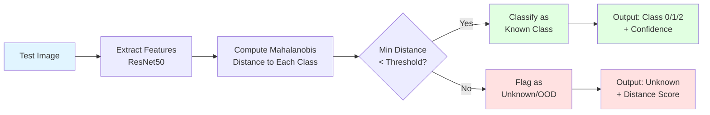
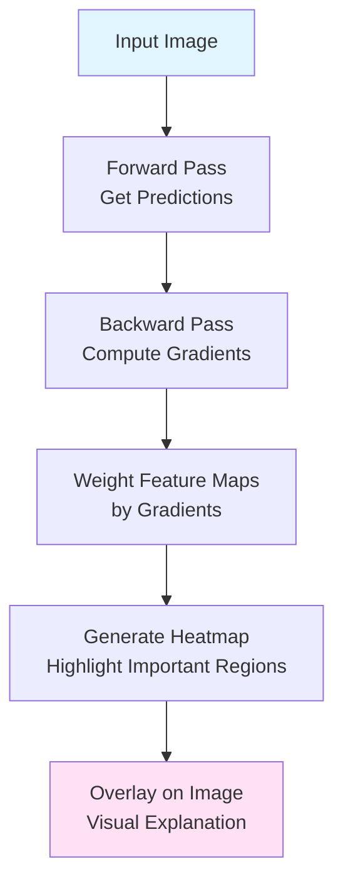
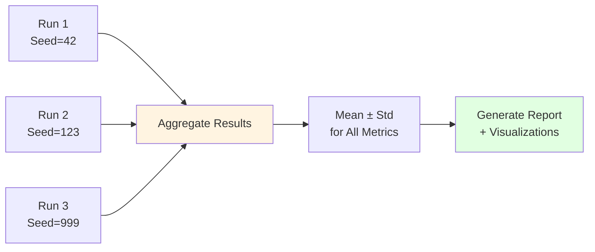
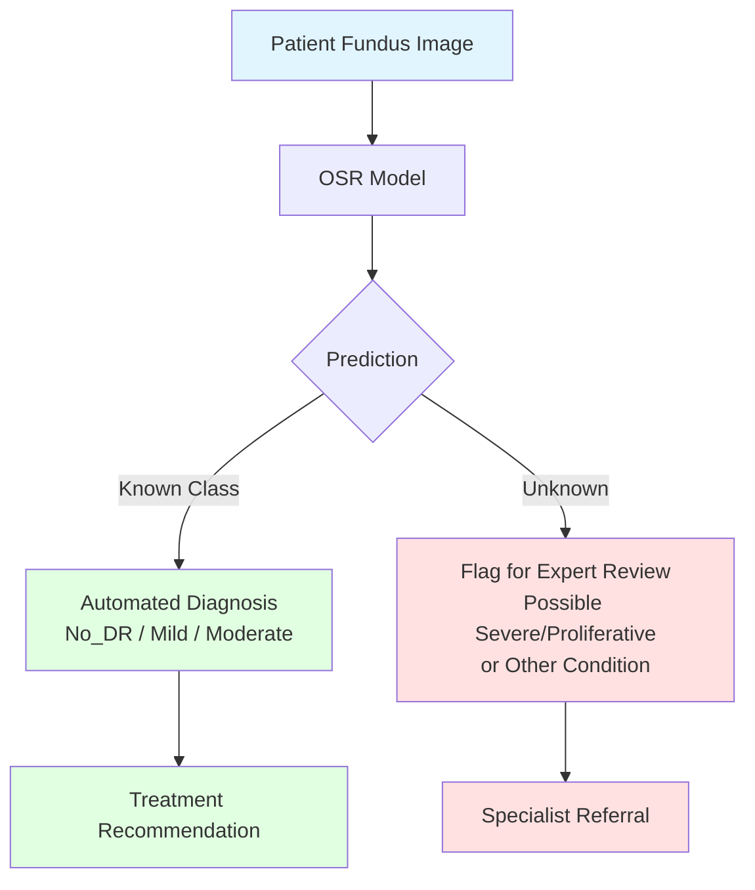

# Figure 1: Model Workflow - Open Set Recognition for Diabetic Retinopathy Detection

## Overview
This document presents the complete workflow of the Open Set Recognition (OSR) system for detecting diabetic retinopathy, including both known class classification and unknown class detection.

---

## System Architecture

```mermaid
flowchart TB
    subgraph Input["📥 Input Data"]
        A[DDR Dataset<br/>5 Classes: No_DR, Mild, Moderate, Severe, Proliferative]
    end
    
    subgraph DataPrep["🔄 Data Preparation"]
        B[Train Set<br/>Known Classes: 0, 1, 2<br/>No_DR, Mild, Moderate]
        C[Test Set<br/>All Classes: 0-4<br/>Known + Unknown]
    end
    
    subgraph Stage1["⚙️ Stage 1: Closed-Set Classification"]
        D[Data Augmentation<br/>• Random Crop<br/>• Flip & Rotation<br/>• Color Jitter]
        E[ResNet50 Backbone<br/>Pre-trained on ImageNet]
        F[Focal Loss Training<br/>γ=2.0, α=[0.4, 1.0, 0.6]<br/>Prevents Class Imbalance]
        G[Feature Extraction<br/>Penultimate Layer<br/>2048-dim features]
    end
    
    subgraph Stage2["🎯 Stage 2: OOD Detection"]
        H[Mahalanobis Distance<br/>Computation]
        I[Class Mean & Covariance<br/>Calculation from Training Set]
        J[Distance-based Scoring<br/>Min Distance to Known Classes]
    end
    
    subgraph Decision["🔍 Decision Making"]
        K{Distance<br/>Threshold?}
        L[Known Class<br/>Classification<br/>Classes 0, 1, 2]
        M[Unknown Detection<br/>Flag as OOD<br/>Classes 3, 4, or Other]
    end
    
    subgraph Output["📊 Output & Evaluation"]
        N[Known Accuracy<br/>Class-wise Performance]
        O[AUROC Score<br/>Unknown Detection]
        P[Combined H-mean Score<br/>Overall Performance]
    end
    
    A --> B
    A --> C
    B --> D
    D --> E
    E --> F
    F --> G
    
    G --> I
    I --> H
    C --> H
    H --> J
    J --> K
    
    K -->|Distance < τ| L
    K -->|Distance ≥ τ| M
    
    L --> N
    M --> O
    N --> P
    O --> P
    
    style Input fill:#e1f5ff
    style Stage1 fill:#fff4e1
    style Stage2 fill:#ffe1f5
    style Decision fill:#e1ffe1
    style Output fill:#f5e1ff
```

---

## Detailed Workflow Stages

### 📥 Stage 0: Data Preparation

**Input:**
- DDR Dataset with 5 severity levels of diabetic retinopathy
- Total classes: No_DR (0), Mild (1), Moderate (2), Severe (3), Proliferative (4)

**Split Configuration:**
- **Training:** Only classes 0, 1, 2 (Known classes)
- **Testing:** All classes 0-4 (Known + Unknown)
- **Openness:** Calculated based on unknown class ratio

---

### ⚙️ Stage 1: Closed-Set Classification with Focal Loss

#### 1.1 Data Augmentation
```
Input Image (Fundus Photography)
    ↓
Resize to 256×256
    ↓
Random Crop to 224×224
    ↓
Random Horizontal/Vertical Flip
    ↓
Random Rotation (±15°)
    ↓
Color Jitter (Brightness, Contrast, Saturation)
    ↓
Normalization (ImageNet stats)
```

#### 1.2 Feature Extraction
- **Backbone:** ResNet50 pre-trained on ImageNet
- **Architecture:**
  - Input: 224×224×3 RGB image
  - Convolutional layers: Extract hierarchical features
  - Penultimate layer: 2048-dimensional feature vector
  - Final FC layer: 3-class classifier

#### 1.3 Focal Loss Training
**Purpose:** Prevent class imbalance and Class 1 collapse

**Formula:**
```
FL(pt) = -αt(1 - pt)^γ log(pt)
```

**Configuration:**
- γ (gamma) = 2.0 → Focus on hard examples
- α (alpha) = [0.4, 1.0, 0.6] → Boost minority class (Class 1)
- Optimizer: AdamW with differential learning rates
- Scheduler: Cosine Annealing

**Training Objectives:**
- Overall Accuracy ≥ 88%
- Class 1 Accuracy ≥ 50%
- Balanced performance across all known classes

---

### 🎯 Stage 2: Mahalanobis Distance-based OOD Detection

#### 2.1 Statistical Modeling
For each known class c ∈ {0, 1, 2}:

1. **Extract Features:** Get penultimate layer features for all training samples
   ```
   f_i ∈ ℝ^2048 for sample i
   ```

2. **Compute Class Mean:**
   ```
   μ_c = (1/N_c) Σ f_i  for all i in class c
   ```

3. **Compute Pooled Covariance:**
   ```
   Σ = (1/N) Σ_c Σ_i (f_i - μ_c)(f_i - μ_c)^T
   ```

#### 2.2 Distance Calculation
For a test sample with feature vector f:

```
Mahalanobis Distance to class c:
D_c(f) = √[(f - μ_c)^T Σ^(-1) (f - μ_c)]

OOD Score = min(D_0, D_1, D_2)
```

#### 2.3 Decision Rule
```
if OOD_Score < threshold τ:
    Predict: argmin_c D_c(f)  → Known class
else:
    Predict: Unknown (OOD)
```

**Typical Distance Ranges:**
- Known samples (No_DR): D < 30
- Known samples (Mild/Moderate): D < 50
- Unknown samples (Severe/Proliferative): D > 50
- Unknown samples (Glaucoma): D > 60

---

### 🔍 Decision Making Process



---

## 📊 Evaluation Metrics

### Known Class Performance
```
Known Accuracy = (Correct Known Predictions) / (Total Known Samples)

Class-wise Accuracy_i = (Correct Class i Predictions) / (Total Class i Samples)
```

**Target:** ≥ 90% overall, ≥ 60% for Class 1

### Unknown Detection Performance
```
AUROC = Area Under ROC Curve
       = P(Score(unknown) > Score(known))
```

**Target:** ≥ 85%

### Combined Performance
```
H-mean = 2 × (Known_Acc × AUROC) / (Known_Acc + AUROC)
```

**Target:** ≥ 87%

---

## 🎯 Key Design Decisions

### Why Focal Loss?
- **Problem:** Class imbalance in DDR dataset (Class 1 is minority)
- **Solution:** Focal Loss with γ=2.0 focuses on hard-to-classify samples
- **Benefit:** Prevents model from ignoring minority class

### Why Mahalanobis Distance?
- **Problem:** Softmax confidence is unreliable for OOD detection
- **Solution:** Statistical distance in feature space
- **Benefit:** Captures class-specific distributions and correlations

### Why Two-Stage Approach?
- **Stage 1:** Optimizes closed-set classification accuracy
- **Stage 2:** Leverages learned features for OOD detection
- **Benefit:** Decouples classification and detection objectives

---

## 🔬 Model Interpretability: Grad-CAM Analysis



**Use Cases:**
- Visualize which retinal features drive predictions
- Identify hardest samples for each class
- Validate model focus on clinically relevant regions (hemorrhages, exudates)

---

## 📈 Reproducibility Pipeline



**Outputs:**
- Mean and standard deviation for all metrics
- Boxplots for class-wise accuracy
- Histograms for Mahalanobis distances
- Configuration files for exact reproduction

---

## 🏥 Clinical Workflow Integration



**Clinical Benefits:**
- **Safety:** Prevents misdiagnosis of severe cases as mild
- **Efficiency:** Automates routine cases (No_DR, Mild, Moderate)
- **Reliability:** Flags uncertain cases for expert review
- **Scalability:** Enables large-scale screening programs

---

## 🔑 Key Takeaways

> **The model acts as a "DR Feature Validator":**
> - **Has DR Features?** → Classify as Mild/Moderate/Severe/Proliferative
> - **No DR Features (Clean)?** → Check if it fits the strict 'No_DR' statistical profile
> - **Neither?** → **Reject as Unknown (Glaucoma/Other)**

**Success Criteria:**
- ✅ Known Accuracy: 90-92%
- ✅ AUROC: 85-92%
- ✅ Class 1 Accuracy: 60-70%
- ✅ Reproducible across multiple seeds

---

## 📚 References

**Key Files:**
- [`train_focal_energy.py`](file:///e:/Open-Set-Recognition-master/train_focal_energy.py) - Stage 1 training
- [`mahalanobis_ood.py`](file:///e:/Open-Set-Recognition-master/mahalanobis_ood.py) - Stage 2 OOD detection
- [`generate_gradcam.py`](file:///e:/Open-Set-Recognition-master/generate_gradcam.py) - Model interpretability
- [`run_reproducibility_pipeline.py`](file:///e:/Open-Set-Recognition-master/run_reproducibility_pipeline.py) - Multi-seed evaluation

**Documentation:**
- [README.md](file:///e:/Open-Set-Recognition-master/README.md) - Project overview
- [reproducibility.md](file:///e:/Open-Set-Recognition-master/reproducibility.md) - Reproducibility results
- [analysis_report.md](file:///e:/Open-Set-Recognition-master/analysis_report.md) - Model analysis

---

*Generated: 2025-11-23*
